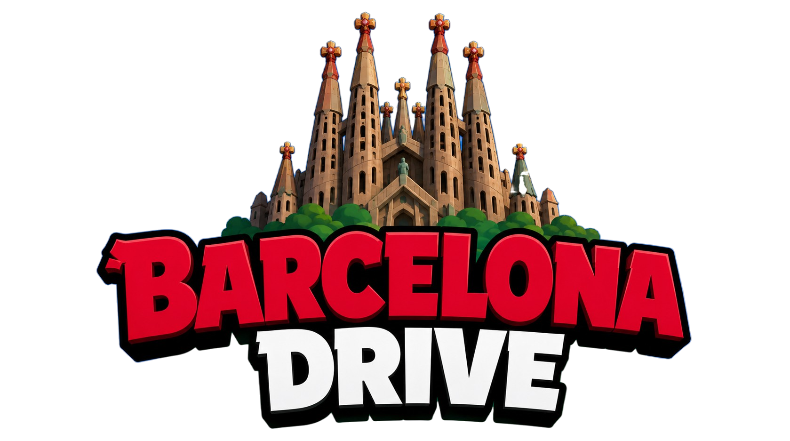

<p align="center">
  
</p>

<p align="center">
  <b>An open-world 3D driving simulator of Barcelona — built on real map + elevation data, running in your browser.</b>
</p>

<p align="center">
  
  
  
  
  
  
</p>

---

Drive a coupe through a streamed, procedurally-detailed **Barcelona** — the Eixample grid with its chamfered corners, Montjuïc's slopes, the waterfront and beaches — with AI traffic, crowds, day/night, sound, and physics-driven handling. The whole city is pre-baked from real OpenStreetMap geometry and a real elevation model into a compact binary format and streamed to the browser as you drive.

Built with **vanilla JavaScript + [Three.js](https://threejs.org/)** (no framework) and **[cannon-es](https://github.com/pmndrs/cannon-es)** physics.

> Migrated from an earlier Delhi build — hence the `delhi-drive` working directory. The active region is Barcelona; the old Delhi tiles remain as a fallback.

---

## ✨ Features

**World**
- 🗺️ **Real city geometry** — roads, buildings, sidewalks, curbs, crosswalks, tram/rail, water, piers and beaches, all derived from OpenStreetMap.
- ⛰️ **Real terrain** — elevation draped from a Copernicus GLO-30 DEM, so hills, slopes and grade are something you actually feel through the car.
- 🌊 **Barcelona-specific detail** — Eixample chamfered corners, bike lanes, zona-30 markings, blue-zone parking, tactile paving, tram rails.

**City life**
- 🚗 **AI traffic** that follows lanes and chains through intersections, with head/tail lights at night.
- 🚶 **Instanced crowds** that walk the sidewalks, dodge oncoming cars, and get knocked down.
- ☂️ **Café terraces** (parasols + tables) and 🏪 **shopfront awnings** in front of ground-floor shops, plus shop-name signage, parked cars, street furniture, bus stops and vendor carts.
- 🌳 **Trees** with 3D → billboard LOD and Mediterranean palettes.

**Feel**
- 🏎️ **Vehicle physics** — `CANNON.RaycastVehicle` with transmission, weight transfer, downforce, an anti-spin stability assist, and an arcade **handbrake drift**.
- 🎧 **Sound** — sample-based engine that pitches and swells with RPM, skids, city ambience, horn, and Doppler pass-bys, all through a shared WebAudio graph.
- 🌗 **Day / night** toggle that re-lights the whole scene — streetlights, vehicle lights, warm ambience → cool moonlight — with a smooth transition.
- 🎬 **Filmic colour grade** and post-processing.

**Shell & UX**
- ▶️ **Title screen** with a grayscale → colour reveal, and a branded **loading screen** with rotating Barcelona facts.
- ⚙️ **In-game settings** (ESC) — global place search + spawn, car colour, sound, fly-mode, stats overlay.
- 🛰️ **Free-fly camera** for exploring the map without the car.

**Engine**
- 📦 **Streaming world** — 500 m × 500 m slippy tiles at zoom 16, loaded in a ring around you and unloaded behind you, phased (buildings → trees → traffic → pedestrians) with a **per-frame build budget** to keep the frame rate smooth.
- 🧵 **Web-worker offload** for heavy geometry (buildings, vegetation, mesh materialization) so the main thread stays free for physics + render.

---

## 🧠 How it works

### Offline bake → runtime stream

```
 OSM PBF extract ─┐
                  ├─►  bake pipeline  ─►  binary v7 tiles  ─►  Express  ─►  browser
 Copernicus DEM ──┘   (worldBuilder/)     (backend/tiles/)     (:4041)      (Three.js @ :4040)
```

The expensive work happens **once, offline**. `backend/worldBuilder/buildRegion.js` reads the PBF + DEM and bakes each tile into a compact binary format (`v7`) — road polylines, building footprints + heights, a downsampled elevation grid, and typed feature lists (trees, shops, piers…). At runtime the Express server just serves those files statically; the frontend streams, decodes, and turns them into meshes + physics colliders on the fly.

### The render ↔ physics coordinate contract ⚠️

The single most important invariant in the codebase:

- The visual scene is **X-mirrored**: `worldGroup.scale.x = -1`.
- Physics therefore **negates X** at the boundary: `px = -(worldX - originX)`, `pz = worldZ - originZ` (Y is *not* mirrored).
- Tile meshes live in the mirrored `worldGroup`; cars and pedestrians live in the physics frame (`scene`).

Every renderer↔physics conversion must apply this negation. Getting it wrong silently misplaces geometry or breaks collisions with **no error** — so if you touch coordinates, read [`docs/context/coordinate-systems.md`](docs/context/coordinate-systems.md) first.

### Streaming & the frame budget

`tileManager.js` keeps a ring of tiles around the viewer. Each tile is built in **phases** across frames, and every phase yields to the main thread once a shared `FRAME_BUDGET_MS` is spent — so a tile popping in never blows the frame. Colliders are time-sliced the same way, and GPU disposal on unload is deferred one tile per frame to avoid GC spikes.

### Physics

Terrain is a single **`CANNON.Heightfield`** per tile (wheels ride it directly); roads float a few centimetres above. Buildings are box / convex-prism colliders, and the chassis is a `RaycastVehicle`. Collision groups keep the car interacting only with world + terrain. (Debug it live with `?debug=collision`, which wireframes every collider near the car.)

### Draw-call discipline

City-life systems are built to be cheap: awnings merge into **one** vertex-coloured mesh per tile; café terraces are **two** InstancedMeshes (furniture + tinted canopies) sharing one set of transforms; shop signs are a single atlas-instanced draw call; pedestrians are instanced flipbooks. Density went up without the frame budget going down.

For the full map — scene graph, game loop, worker protocol, LOD, invariants and design decisions — start at [`CLAUDE.md`](CLAUDE.md), which indexes the deep-dive docs in [`docs/context/`](docs/context/).

---

## 🚀 Getting started

### Prerequisites

- **Node.js 20+** (Vite 7).
- **Map tiles.** The baked tiles (`backend/tiles/`, ~12 GB) and the region source data (`data/regions/` — OSM PBF + DEM, ~2 GB) are **git-ignored**, so a fresh clone has no map to drive on. Either bake the tiles yourself (see [Baking the world](#-baking-the-world)) or drop in a pre-baked `backend/tiles/barcelona/` directory.

### Install

```bash
# from the repo root
cd backend    && npm install
cd ../frontend && npm install
```

### Run

```bash
# 1. Tile server  → http://localhost:4041
cd backend && npm start

# 2. Frontend dev → http://localhost:4040
cd frontend && npm run dev
```

Open **http://localhost:4040**.

> **Port note:** the backend hard-codes `Access-Control-Allow-Origin: http://localhost:4040`, and Vite serves on `4040`. If you change one, change both (`backend/server.js` and the Vite config).

---

## 🎮 Controls

| Key | Action |
|---|---|
| **W** / ↑ | Accelerate |
| **S** / ↓ | Brake / reverse |
| **A** / ← , **D** / → | Steer |
| **Space** | Handbrake — hold while turning to drift |
| **H** | Horn |
| **Esc** | Settings (spawn search, car colour, sound, fly mode) |

### URL toggles

Append to the URL and reload:

| Param | Effect |
|---|---|
| `?mode=car` (or `?car`) | Drive the car (default) |
| `?mode=fly` (or `?fly`) | Free-fly camera, no car |
| `?spawn=lat,lon` | Spawn at a specific coordinate |
| `?debug=collision` (or `?debug=walls`) | Wireframe every collider within 50 m of the car |
| `?debug=tunnel` | Tunnel / collider + tile-seam debug overlay |

Combine freely, e.g. `http://localhost:4040/?mode=car&debug=collision`.

---

## 🏗️ Baking the world

Baking reads the region source data in `data/regions/barcelona/` (an OSM `.pbf` extract + a DEM GeoTIFF — both git-ignored) and writes binary tiles to `backend/tiles/barcelona/`.

```bash
cd backend

# Full Barcelona region (slow — minutes)
npm run build:region

# Faster partial bakes (need the PBF + DEM in data/regions/barcelona/)
node worldBuilder/buildRegion.js --area eixample     # ~20 tiles around the Eixample
node worldBuilder/buildRegion.js --area montjuic      # port + Montjuïc elevation

# Single-tile dry run (prints v7 feature counts, writes one tile)
BAKE_SINGLE_TILE=16_33143_24488 node worldBuilder/buildRegion.js --area eixample
```

After re-baking, clear the browser tile cache: run `window._clearTileCache()` in the dev console and hard-reload, or stale tiles will be served.

> Re-baking is expensive and can invalidate runtime assumptions about baked elevation. Read [`docs/context/bake-pipeline.md`](docs/context/bake-pipeline.md) before changing the pipeline.

---

## 📁 Project structure

```
backend/
  server.js               # Express static tile server (:4041)
  worldBuilder/           # OSM PBF + DEM → binary v7 tile bake pipeline
  osmParser.js, roadProcessor.js, buildingShapes.js, ...
  tiles/                  # baked tiles (git-ignored, ~12 GB)

data/regions/             # OSM PBF + DEM source data (git-ignored, ~2 GB)

frontend/src/
  main.js                 # game loop, init, spawn, subsystem wiring
  config.js               # feature toggles + tuning constants
  car/                    # vehicle physics, controls, camera, effects, traffic, pedestrians, sound
  map/                    # tile streaming, road/building/vegetation + city-life renderers, colliders
  audio/                  # WebAudio graph + sample manager
  ui/                     # settings menu, minimap, HUD, day/night toggle
  workers/                # geometry + mesh-materialization Web Workers

docs/context/             # deep-dive architecture docs (indexed by CLAUDE.md)
docs/assets/              # README art
```

---

## ⚙️ Configuration

- **Feature flags & tuning** live in [`frontend/src/config.js`](frontend/src/config.js) — toggle traffic, pedestrians, trees, awnings, café terraces, skid marks, day/night; adjust tree LOD distances and physics constants.
- **Backend port** via the `PORT` env var (default `4041`).

---

## 🌐 Deploying

Because the baked tiles are git-ignored, a deployed instance needs the map data supplied separately:

1. Run the bake pipeline on the server and serve `backend/tiles/` from Express, **or**
2. Host the baked tiles on object storage / a CDN and point the frontend at that base URL, **or**
3. Ship a small subset of tiles for a limited playable area.

The frontend is a static Vite build (`npm run build` in `frontend/`); the backend is a tiny Express app whose only job is serving tile files.

---

## 🙏 Credits

- Map data © [OpenStreetMap](https://www.openstreetmap.org/copyright) contributors (ODbL).
- Minimap basemap © OpenStreetMap contributors © [CARTO](https://carto.com/attributions) (Positron).
- Elevation from the [Copernicus GLO-30](https://spacedata.copernicus.eu/) global DEM.
- 3D models from [Kenney](https://kenney.nl/) and [Poly Pizza](https://poly.pizza/) (check individual asset licenses before redistribution).
- Audio: CC0 / public-domain loops (see `frontend/public/audio/ATTRIBUTION.md`).

<p align="center"><sub>Built with <a href="https://claude.com/claude-code">Claude Code</a>.</sub></p>
